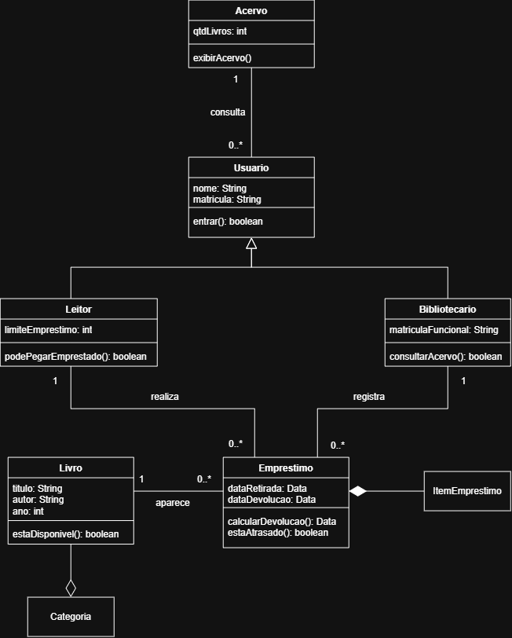

# Atividade 18 — Diagrama de Classes do BiblioTech
Nome: LUIZ OTÁVIO DE SOUZA FREO
Turma: 2º ano — Técnico em Informática Integrado

## Diagrama

## Por que estes números (associação Bibliotecario — Emprestimo)
- Perto de Emprestimo eu coloquei 0..* porque UM bibliotecário PODE registrar vários empréstimos
- Perto de Bibliotecario eu coloquei 1 porque UM empréstimo é registrado por UM bibliotecário

## Rastreabilidade (nível B)
- A operação exibirAcervo() da classe Acervo atende ao caso de uso Consultar acervo

## Pergunta extra (nível A)
- "um colega diz que Bibliotecario nem precisava ser classe — bastava um atributo bibliotecario: String dentro de Emprestimo. Ele está certo?"
- Não, pois a classe Bibliotecario, não guarda somente um valor específico (como apenas nome), mas também possui operações próprias, que não podem existir em um atributo.

## Autoavaliação
- Conceito que pretendo: A
- Onde isso se prova no diagrama (classe / linha / número): Desenvolvi o diagrama seguindo as orientações e a notação devida, colocando: todas as classes e mais uma extra, todas as linhas nas suas devidas formas, e todos os números seguindo uma lógica coerente.
